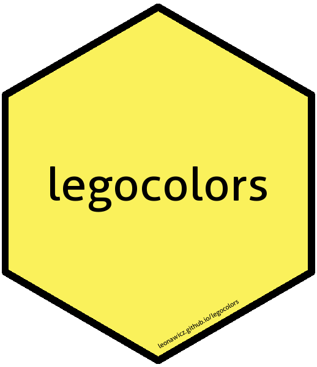

<!-- README.md is generated from README.Rmd. Please edit that file -->
legocolors <a href="man/figures/logo.png" _target="blank"></a>
====================================================================================================================================================================

**Author:** [Matthew Leonawicz](https://leonawicz.github.io/blog/) <a href="https://orcid.org/0000-0001-9452-2771" target="orcid.widget"> <image class="orcid" src="https://members.orcid.org/sites/default/files/vector_iD_icon.svg" height="16"></a> <br/> **License:** [MIT](https://opensource.org/licenses/MIT)<br/> <!-- badges: start --> [](https://cran.r-project.org/package=legocolors) [](https://cran.r-project.org/package=legocolors) [](http://www.rdocumentation.org/packages/legocolors) [](https://travis-ci.org/leonawicz/legocolors) [](https://ci.appveyor.com/project/leonawicz/legocolors) [](https://codecov.io/gh/leonawicz/legocolors?branch=master) <!-- badges: end -->

`legocolors` provides a dataset containing several Lego color naming conventions established by various popular sources. It also provides functions for mapping between these color naming conventions as well as between Lego color names, hex colors, and R color names.

By default, nearest colors are computed based on distance in RGB space when an exact match is not found. This behavior supports the purpose of exchanging arbitrary colors for known Lego colors when the goal is to actually acquire and build something out of Lego parts. This focus is also one of the reasons `legocolors` uses BrickLink color names as the default naming convention. See `?legocolor` for details.

Installation
------------

You can install the released version of `legocolors` from [CRAN](https://CRAN.R-project.org) with:

``` r
install.packages("legocolors")
```

You can install the development version of `legocolors` from GitHub with:

``` r
# install.packages("remotes")
remotes::install_github("leonawicz/legocolors")
```

Example
-------

The key helper functions are `hex_to_legocolor` and `legocolor_to_hex`. `hex_to_color` is also provided for general convenience.

``` r
library(legocolors)
hex_to_color(c("#ff0000", "#ff0001"))
#> [1] "red"  "~red"
hex_to_legocolor("#ff0000")
#> [1] "~Trans-Red"
hex_to_legocolor("#ff0000", material = "solid")
#> [1] "~Red"
legocolor_to_hex("Red")
#> [1] "#B40000"
hex_to_color(legocolor_to_hex("Red"))
#> [1] "~red3"

x <- topo.colors(10)
hex_to_legocolor(x)
#>  [1] "~Dark Purple"              "~Blue"                    
#>  [3] "~Trans-Dark Blue"          "~Medium Azure"            
#>  [5] "~Bright Green"             "~Lime"                    
#>  [7] "~Glitter Trans-Neon Green" "~Trans-Yellow"            
#>  [9] "~Trans-Neon Green"         "~Light Flesh"
hex_to_legocolor(x, material = "solid")
#>  [1] "~Dark Purple"         "~Blue"                "~Dark Azure"         
#>  [4] "~Medium Azure"        "~Bright Green"        "~Lime"               
#>  [7] "~Yellow"              "~Yellow"              "~Bright Light Yellow"
#> [10] "~Light Flesh"
hex_to_legocolor(x, def = "tlg", material = "solid")
#>  [1] "~Medium Lilac"           "~Bright Blue"           
#>  [3] "~Dark Azur"              "~Medium Azur"           
#>  [5] "~Bright Green"           "~Bright Yellowish Green"
#>  [7] "~Bright Yellow"          "~Bright Yellow"         
#>  [9] "~Cool Yellow"            "~Light Nougat"
```

What this package does not (yet) do: Currently, there is no ability to filter the color mapping to Lego colors known to be available specifically for simple brick and/or plate parts. This is why results may return exotic, difficult to acquire colors, or colors which are only used in specialty parts that may not be amenable to general building.
