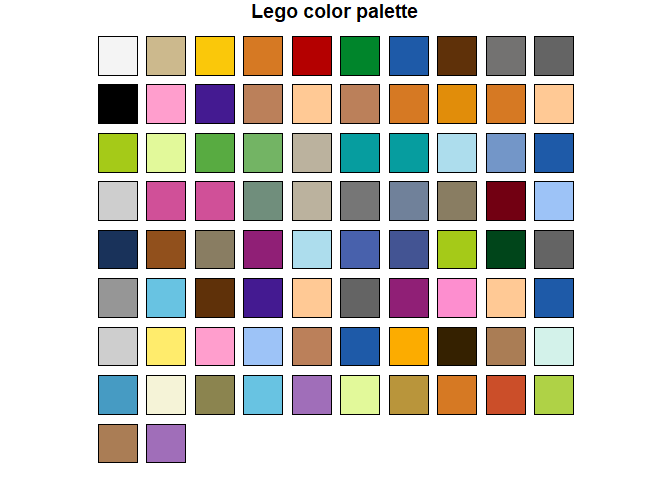

<!-- README.md is generated from README.Rmd. Please edit that file -->
legocolors <a href="man/figures/logo.png" _target="blank"></a>
====================================================================================================================================================================

**Author:** [Matthew Leonawicz](https://leonawicz.github.io/blog/) <a href="https://orcid.org/0000-0001-9452-2771" target="orcid.widget"> <image class="orcid" src="https://members.orcid.org/sites/default/files/vector_iD_icon.svg" height="16"></a> <br/> **License:** [MIT](https://opensource.org/licenses/MIT)<br/> <!-- badges: start --> [](https://cran.r-project.org/package=legocolors) [](https://cran.r-project.org/package=legocolors) [](http://www.rdocumentation.org/packages/legocolors) [](https://travis-ci.org/leonawicz/legocolors) [](https://ci.appveyor.com/project/leonawicz/legocolors) [](https://codecov.io/gh/leonawicz/legocolors?branch=master) <!-- badges: end -->

`legocolors` provides a dataset containing several Lego color naming conventions established by various popular sources. It also provides functions for mapping between these color naming conventions as well as between Lego color names, hex colors, and R color names.

By default, nearest colors are computed based on distance in RGB space when an exact match is not found. This behavior supports the purpose of exchanging arbitrary colors for known Lego colors when the goal is to actually acquire and build something out of Lego parts. This focus is also one of the reasons `legocolors` uses BrickLink color names as the default naming convention. See `?legocolor` for details.

Installation
------------

You can install the released version of `legocolors` from [CRAN](https://CRAN.R-project.org) with:

``` r
install.packages("legocolors")
```

You can install the development version of `legocolors` from GitHub with:

``` r
# install.packages("remotes")
remotes::install_github("leonawicz/legocolors")
```

Palette conversions
-------------------

The key helper functions are `hex_to_legocolor` and `legocolor_to_hex`. `hex_to_color` is also provided for general convenience.

``` r
library(legocolors)
hex_to_color(c("#ff0000", "#ff0001"))
#> [1] "red"  "~red"
hex_to_legocolor("#ff0000")
#> [1] "~Trans-Red"
hex_to_legocolor("#ff0000", material = "solid")
#> [1] "~Red"
legocolor_to_hex("Red")
#> [1] "#B40000"
hex_to_color(legocolor_to_hex("Red"))
#> [1] "~red3"

x <- topo.colors(10)
hex_to_legocolor(x)
#>  [1] "~Dark Purple"              "~Blue"                    
#>  [3] "~Trans-Dark Blue"          "~Medium Azure"            
#>  [5] "~Bright Green"             "~Lime"                    
#>  [7] "~Glitter Trans-Neon Green" "~Trans-Yellow"            
#>  [9] "~Trans-Neon Green"         "~Light Flesh"
hex_to_legocolor(x, material = "solid")
#>  [1] "~Dark Purple"         "~Blue"                "~Dark Azure"         
#>  [4] "~Medium Azure"        "~Bright Green"        "~Lime"               
#>  [7] "~Yellow"              "~Yellow"              "~Bright Light Yellow"
#> [10] "~Light Flesh"
hex_to_legocolor(x, def = "tlg", material = "solid")
#>  [1] "~Medium Lilac"           "~Bright Blue"           
#>  [3] "~Dark Azur"              "~Medium Azur"           
#>  [5] "~Bright Green"           "~Bright Yellowish Green"
#>  [7] "~Bright Yellow"          "~Bright Yellow"         
#>  [9] "~Cool Yellow"            "~Light Nougat"
```

While different sets of Lego colors are organized by `material` type, e.g., solid colors, semi-transparent colors, etc., these palettes are not useful for plotting data. The greatest value comes from converting useful color palettes to those comprised of existing Lego colors while still keeping as close to the original palette as possible.

Palette preview
---------------

The `view_legopal` function can be used to quickly see a Lego color palette. It can plot a named `material` palette, but like the functions above, it can also display a converted palette if given an arbitrary vector of hex color values.

``` r
view_legopal("solid")
```



``` r

r <- rainbow(9)
r
#> [1] "#FF0000FF" "#FFAA00FF" "#AAFF00FF" "#00FF00FF" "#00FFAAFF" "#00AAFFFF"
#> [7] "#0000FFFF" "#AA00FFFF" "#FF00AAFF"

view_legopal(r, material = "solid", show_labels = TRUE, label_size = 0.7)
```


Recommended colors
------------------

Filtering to a decent set of Lego colors that are relatively easy to acquire online at BrickLink.com for simple brick and/or plate parts can be done using the `recommended` column in the `legocolors` dataset. This logical column is originally derived using the following criteria:

``` r
library(dplyr)
rec <- arrange(legocolors, desc(bl_bp)) %>%
  filter(is.na(year_retired) & material == "solid" & bl_bp > 0.1) %>%
  select(bl_name, bl_bp)

distinct(rec)
#> # A tibble: 36 x 2
#>    bl_name           bl_bp
#>    <chr>             <dbl>
#>  1 White             1    
#>  2 Black             0.962
#>  3 Light Bluish Gray 0.927
#>  4 Red               0.912
#>  5 Dark Bluish Gray  0.896
#>  6 Tan               0.851
#>  7 Blue              0.803
#>  8 Yellow            0.797
#>  9 Reddish Brown     0.731
#> 10 Green             0.679
#> # ... with 26 more rows

filter(legocolors, recommended & !is.na(year_released))$hex %>%
  view_legopal(show_labels = TRUE, label_size = 0.5)
```


The `bl_bp` column provides a rough estimate of the relative availability of simple bricks and/or plates in a particular color for sale worldwide on BrickLink, scaled between 0 and 1. This is only computed when the package is updated, but these values should not fluctuate wildly. The metric used is also not perfect, but it will at least provide a much more reasonable set of colors in terms of reasonably obtainable bricks and plates.

You can use the variables in `legocolors` differently to derive your own subset of colors that are relatively acquirable. This is worth considering because even though BrickLink consistently offers the widest selection and greatest quantity at the lowest price, supply and demand leads to some parts in some colors being prohibitively expensive to acquire in quantity. When determining what colors you wish to use to build a physical model, you will save an incredible amount of money if you can accept limiting your palette to the most common Lego colors.

The rough metric used here represents an initial step at avoiding Lego color palettes containing the more exotic, difficult to acquire colors, or colors which are only used in specialty parts that may not be amenable to general building with basic bricks and plates.
